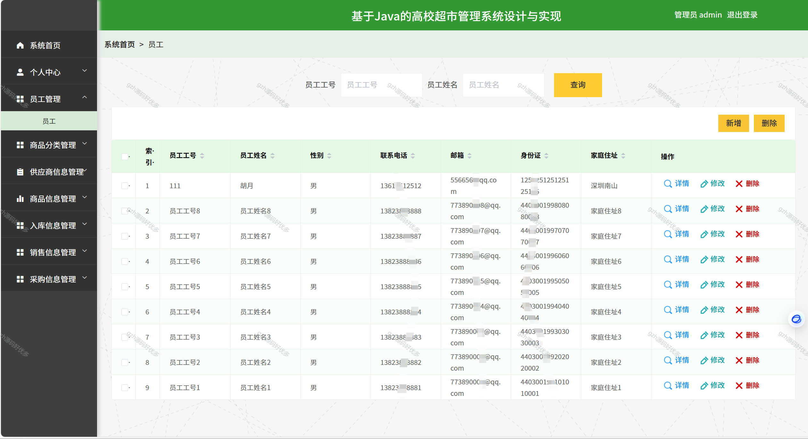
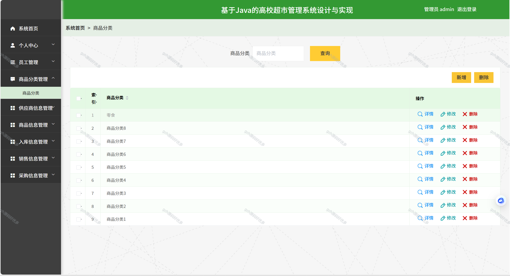
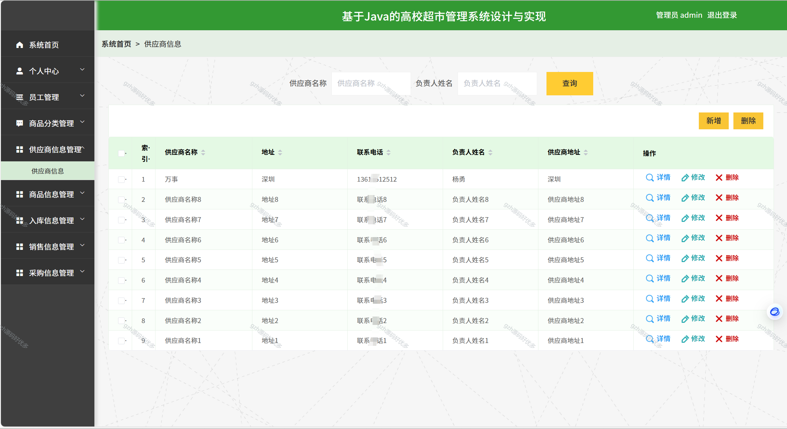
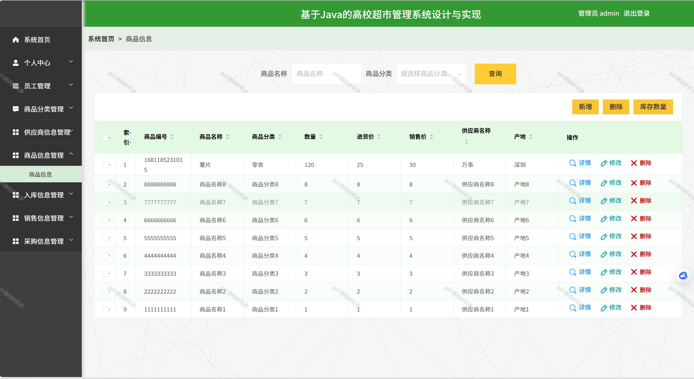
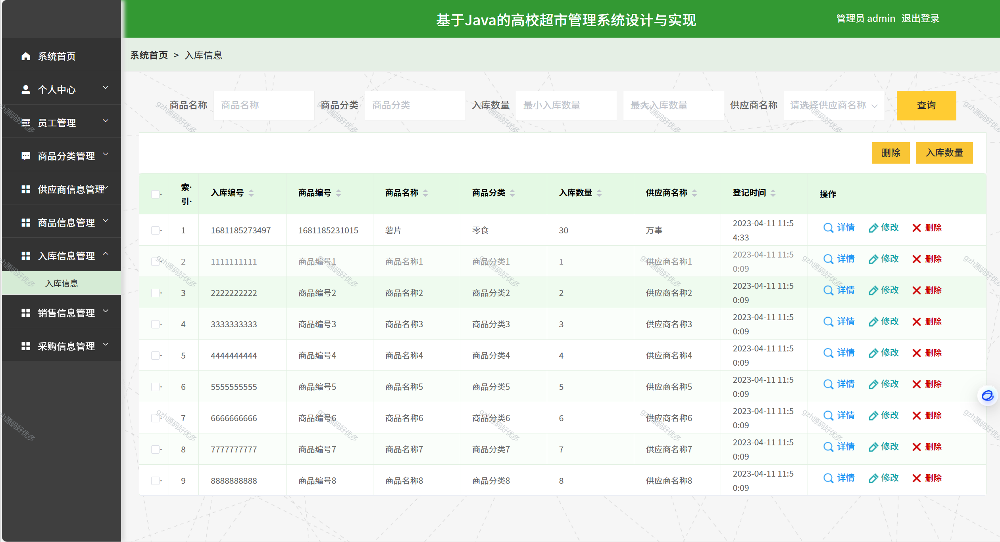
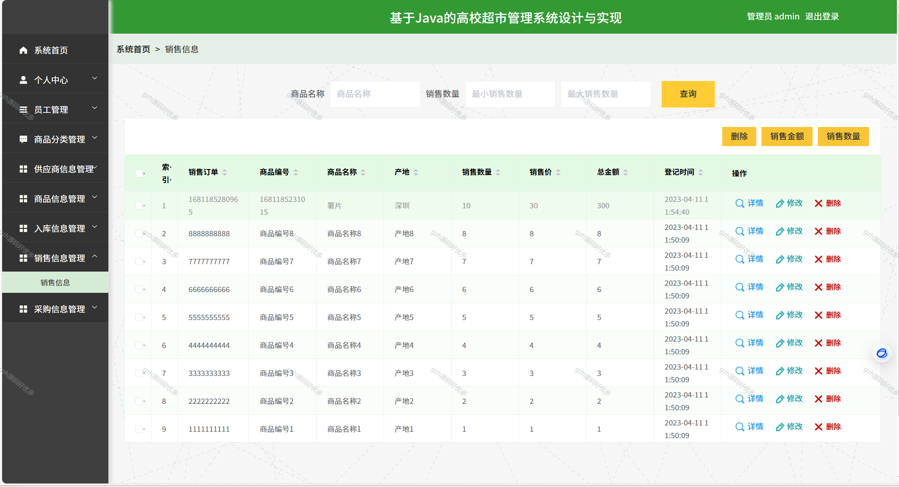
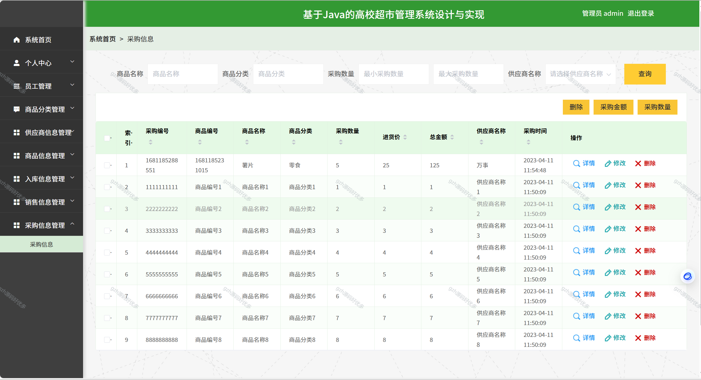
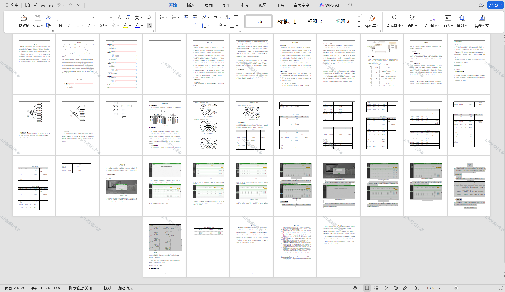

# springbootA255
springbootA255高校超市管理系统
 
## 查看主页获取源码

### 一、关键词
大学超市管理系统，高校校园超市管理系统，高校超市信息管理系统

### 二、作品包含
源码+数据库+设计文档万字+全套环境和工具资源+部署教程

### 三、项目技术
前端技术：Html、Css、Js、Vue2.0、Element-ui 
后端技术：Java、SpringBoot2.0、MyBatis

### 四、运行环境（以下版本亲测，其他版本未知，请自测）
开发工具：IDEA/eclipse  + VSCODE

数据库：MySQL5.7（最低要5.7版本）

数据库管理工具：Navicat10以上版本

环境配置软件： JDK1.8 + Maven3.6.3

前端Nodejs：14

浏览器：谷歌浏览器

### 五、项目介绍
项目编号：springbootA255
为解决员工需求，高校超市管理发展愈发多元化与网络化，与电子信息技术相结合。高校超市管理系统应运而生。
该系统由管理员功能模块和员工模块组成。不同角色的准入制度是有严格区别的。各功能模块的设计也便于以后的系统升级和维护。该系统采用了软件组件化、精化体系结构、分离逻辑和数据等方法。

### 六、运行截图

